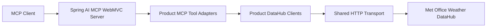

# Met Office MCP Server 🌦️

[](https://adoptium.net/)
[](https://spring.io/projects/spring-boot)
[](https://gradle.org/)
[](https://modelcontextprotocol.io/)
[](https://www.graalvm.org/)

A Java 21 Spring Boot MCP server that exposes Met Office Weather DataHub products as tools for MCP clients.

## ✨ Features

- 🌍 Site-specific forecasts from Global Spot and blended probabilistic forecast APIs.
- 🌡️ Recent Land Observations by station geohash or nearest station.
- 🛰️ Atmospheric model order metadata and GRIB file downloads.
- 🗺️ Map image order metadata and PNG file downloads.
- 📦 JSON payload passthrough for vendor response bodies.
- 🔐 Per-product Met Office API keys sent as `apikey` headers.
- ⚠️ Typed error envelopes for missing keys, non-2xx responses, and local validation failures.
- 🧬 GraalVM native-image support through Gradle and Spring Boot buildpacks.

## 🧭 How It Works



Each MCP tool adapter is thin: it accepts MCP tool parameters, builds a request record, and delegates to the matching product client. Product clients own their API key configuration and pass it to the shared HTTP transport, which adds the `apikey` header and normalizes responses.

## ✅ Requirements

| Need | Required for | Notes |
| --- | --- | --- |
| Java 21 | Local JVM build, tests, and `bootRun` | The Gradle toolchain targets Java 21. |
| Gradle wrapper | All local Gradle commands | Use `.\gradlew.bat` on Windows or `./gradlew` on Unix-like shells. |
| Met Office DataHub API keys | Calling live Met Office APIs | Configure one key per product area. |
| Docker | Testcontainers and container images | Required for containerized tests and `bootBuildImage`. |
| GraalVM 25+ | Local native executable builds | Native container builds use Java 25 through the buildpack setting. |

> [!NOTE]
> Spring Boot 4 native container images need a Java 25 GraalVM/NIK buildpack. This project sets `BP_JVM_VERSION=25` when `-PnativeImage` is used.

## 🔐 Configuration

Set the API keys for the Met Office products you want to use:

| Environment variable | Product |
| --- | --- |
| `MET_OFFICE_ATMOSPHERIC_API_KEY` | Atmospheric models |
| `MET_OFFICE_SITE_SPECIFIC_API_KEY` | Site-specific Global Spot and BPF forecasts |
| `MET_OFFICE_OBSERVATIONS_API_KEY` | Land Observations |
| `MET_OFFICE_MAP_IMAGES_API_KEY` | Map images |

Optional base URL overrides:

| Environment variable | Default |
| --- | --- |
| `MET_OFFICE_ATMOSPHERIC_BASE_URL` | `https://data.hub.api.metoffice.gov.uk/atmospheric-models/1.0.0` |
| `MET_OFFICE_SITE_SPECIFIC_GLOBAL_SPOT_BASE_URL` | `https://data.hub.api.metoffice.gov.uk/sitespecific/v0/point` |
| `MET_OFFICE_SITE_SPECIFIC_BPF_BASE_URL` | `https://data.hub.api.metoffice.gov.uk/mo-site-specific-blended-probabilistic-forecast/1.0.0` |
| `MET_OFFICE_OBSERVATIONS_BASE_URL` | `https://data.hub.api.metoffice.gov.uk/observations/1.0.0` |
| `MET_OFFICE_MAP_IMAGES_BASE_URL` | `https://data.hub.api.metoffice.gov.uk/map-images/1.0.0` |

PowerShell:

```powershell
$env:MET_OFFICE_ATMOSPHERIC_API_KEY="your-atmospheric-key"
$env:MET_OFFICE_SITE_SPECIFIC_API_KEY="your-site-specific-key"
$env:MET_OFFICE_OBSERVATIONS_API_KEY="your-observations-key"
$env:MET_OFFICE_MAP_IMAGES_API_KEY="your-map-images-key"
```

Bash:

```bash
export MET_OFFICE_ATMOSPHERIC_API_KEY="your-atmospheric-key"
export MET_OFFICE_SITE_SPECIFIC_API_KEY="your-site-specific-key"
export MET_OFFICE_OBSERVATIONS_API_KEY="your-observations-key"
export MET_OFFICE_MAP_IMAGES_API_KEY="your-map-images-key"
```

> [!IMPORTANT]
> Do not commit real API keys. Keep secrets in your shell environment, deployment secret store, or a local `.env` file that stays ignored by Git.

## 🚀 Quick Start

Run tests:

```powershell
.\gradlew.bat test
```

Start the MCP server locally:

```powershell
.\gradlew.bat bootRun
```

Unix-like shells:

```bash
./gradlew test
./gradlew bootRun
```

The app starts as a Spring Boot WebMVC application on port `8080` unless `server.port` is overridden. Configure your MCP client to connect to the Spring AI MCP server endpoint exposed by the running application.

## 🐳 Docker Usage

Run the published image from GHCR:

```bash
docker run --rm \
  --name met-office-mcp-server \
  -p 8080:8080 \
  -e MET_OFFICE_ATMOSPHERIC_API_KEY="your-atmospheric-key" \
  -e MET_OFFICE_SITE_SPECIFIC_API_KEY="your-site-specific-key" \
  -e MET_OFFICE_OBSERVATIONS_API_KEY="your-observations-key" \
  -e MET_OFFICE_MAP_IMAGES_API_KEY="your-map-images-key" \
  ghcr.io/smling/met-office-mcp-server:latest
```

Use Docker Compose:

```yaml
services:
  met-office-mcp-server:
    image: ${MET_OFFICE_MCP_IMAGE:-ghcr.io/smling/met-office-mcp-server:latest}
    container_name: met-office-mcp-server
    ports:
      - "8080:8080"
    environment:
      MET_OFFICE_ATMOSPHERIC_API_KEY: ${MET_OFFICE_ATMOSPHERIC_API_KEY}
      MET_OFFICE_SITE_SPECIFIC_API_KEY: ${MET_OFFICE_SITE_SPECIFIC_API_KEY}
      MET_OFFICE_OBSERVATIONS_API_KEY: ${MET_OFFICE_OBSERVATIONS_API_KEY}
      MET_OFFICE_MAP_IMAGES_API_KEY: ${MET_OFFICE_MAP_IMAGES_API_KEY}
    restart: unless-stopped
```

This repository also includes a root [`docker-compose.yaml`](docker-compose.yaml) that reads the same values from `.env` through `env_file`.

Example `.env` for Compose:

```dotenv
MET_OFFICE_ATMOSPHERIC_API_KEY=your-atmospheric-key
MET_OFFICE_SITE_SPECIFIC_API_KEY=your-site-specific-key
MET_OFFICE_OBSERVATIONS_API_KEY=your-observations-key
MET_OFFICE_MAP_IMAGES_API_KEY=your-map-images-key
MET_OFFICE_MCP_IMAGE=ghcr.io/smling/met-office-mcp-server:latest
```

> [!NOTE]
> The image name follows this repository's GHCR path: `ghcr.io/smling/met-office-mcp-server`. Use a version tag instead of `latest` when pinning production deployments.

## 🧰 MCP Tools

| Product | Tool | Purpose |
| --- | --- | --- |
| Atmospheric | `metoffice_atmospheric_orders` | List active atmospheric model orders. |
| Atmospheric | `metoffice_atmospheric_latest_order` | Get latest metadata for an atmospheric model order. |
| Atmospheric | `metoffice_atmospheric_file` | Download an atmospheric model GRIB file as base64. |
| Site-specific | `metoffice_site_specific_global_spot` | Get Global Spot forecast GeoJSON for latitude and longitude. |
| Site-specific | `metoffice_bpf_collections` | List BPF forecast collections. |
| Site-specific | `metoffice_bpf_locations` | List locations for a BPF collection. |
| Site-specific | `metoffice_bpf_forecast` | Get BPF forecast JSON for a collection and location. |
| Observations | `metoffice_observations_nearest_station` | Find the nearest Land Observations station geohash. |
| Observations | `metoffice_observations_by_geohash` | Get recent Land Observations for a station geohash. |
| Observations | `metoffice_observations_by_location` | Get recent Land Observations for the nearest station to latitude and longitude. |
| Map images | `metoffice_map_image_orders` | List active map image orders. |
| Map images | `metoffice_map_image_latest_order` | Get latest metadata for a map image order. |
| Map images | `metoffice_map_image_file` | Download a PNG map image file as base64. |

Binary responses, such as GRIB and PNG files, are returned as base64 strings inside the normal tool response envelope.

## 🧪 Testing

Run the full test suite:

```powershell
.\gradlew.bat test
```

Compile, test, and package:

```powershell
.\gradlew.bat build
```

Tests cover property binding, per-product API key headers, request URI construction, response parsing, base64 binary handling, typed error envelopes, local validation, and thin MCP adapter delegation.

> [!NOTE]
> Testcontainers MockServer tests require a working Docker engine. Run them on a Docker-enabled machine or CI before merging HTTP client changes.

## 📦 Build & Release

Build the JVM application:

```powershell
.\gradlew.bat build
```

Build a local native executable:

```powershell
.\gradlew.bat nativeCompile
```

Build a native container image:

```powershell
.\gradlew.bat bootBuildImage -PnativeImage -PnativeImageJvmVersion=25
```

Build a regular JVM container image:

```powershell
.\gradlew.bat bootBuildImage
```

> [!NOTE]
> Java 21 is the normal project toolchain. Java 25 is used for the buildpack native-image path because Spring Boot 4 native images are not supported by the Paketo Spring Boot buildpack with a lower downloaded GraalVM/NIK version.

## 🗂️ Project Layout

```text
src/main/java/io/github/smling/met_office_mcp_server/
├── client/         # Shared transport and product-specific DataHub clients
├── model/          # Request records, response envelope, and product metadata
├── tools/          # MCP tool adapters grouped by Met Office product
├── MetOfficeMcpServerApplication.java
└── MetOfficeProperties.java

src/main/resources/application.yaml   # Runtime configuration
src/test/java/...                      # Tests mirroring production packages
.github/workflows/                    # CI and CD workflows
memory-bank/                          # Durable project context for future agents
```

## 🛡️ Security Notes

- API keys are sent to Met Office DataHub as `apikey` headers.
- API keys must not be placed in query parameters.
- Product clients own API key lookup; the shared transport only receives and applies keys.
- Keep `application.yaml`, examples, and committed files free of real secrets.

## 🤝 Contributing

- Follow the repository conventions in [`AGENTS.md`](AGENTS.md).
- Keep product clients under `client/<product>` and MCP adapters under `tools/<product>`.
- Add or update focused tests when changing tool behavior, request construction, response handling, or validation.
- Run `.\gradlew.bat test` before opening a pull request.
- Update `memory-bank/` when changes affect architecture, public behavior, dependencies, configuration, test strategy, known risks, or follow-up work.

## 📚 References

- [Met Office Weather DataHub](https://datahub.metoffice.gov.uk/)
- [Model Context Protocol](https://modelcontextprotocol.io/)
- [Spring AI](https://spring.io/projects/spring-ai)
- [Spring Boot Gradle Plugin](https://docs.spring.io/spring-boot/gradle-plugin/)
- [GraalVM Native Image](https://www.graalvm.org/latest/reference-manual/native-image/)
- [Paketo Java Native Image Buildpack](https://paketo.io/docs/reference/java-native-image-reference/)
